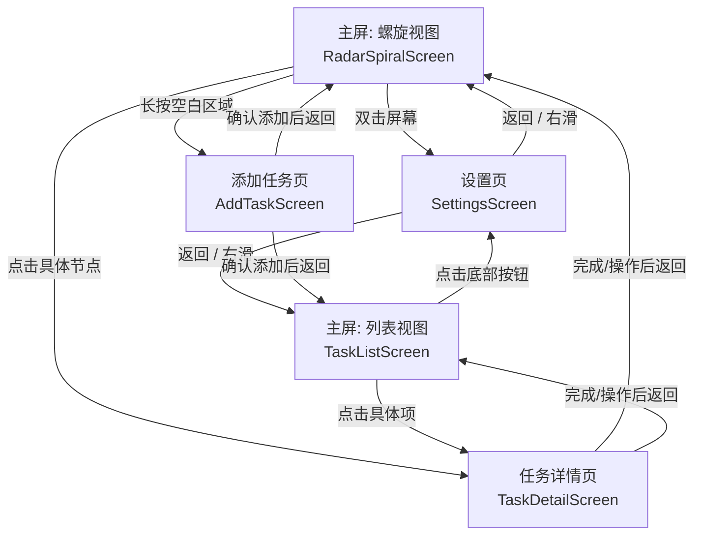

# Watch-Task UI 架构与界面逻辑指南

本文档旨在梳理当前 `watch-task` 项目的 UI 架构、包含的界面、布局特征以及各界面之间的逻辑关系。**此文档专供新开对话窗口时作为初始上下文使用，帮助快速理解项目界面现状并开展后续开发。**

---

## 1. 核心架构与状态管理

本项目采用 **Jetpack Compose for Wear OS** 构建 UI，所有界面的入口和导航逻辑位于 `MainActivity.kt`，UI 组件的定义主要集中在 `TaskComponents.kt`，全局状态管理由 `TaskViewModel` 负责。

### 1.1 导航管理 (Navigation)
- 使用 Wear OS 原生的 `SwipeDismissableNavHost` 处理页面跳转。
- **核心路由表**：
  - `"home"`: 主界面路由，根据状态动态渲染为**螺旋视图**或**列表视图**。
  - `"detail/{taskId}"`: 任务详情页面，附带任务 ID。
  - `"addTask"`: 添加新任务页面。
  - `"settings"`: 系统设置页面。

### 1.2 视图模式状态 (State)
- `TaskViewModel` 中维护了 `isListViewEnabled: Boolean` 状态。
- 当 `isListViewEnabled == false` 时，`"home"` 路由展示 `RadarSpiralScreen`。
- 当 `isListViewEnabled == true` 时，`"home"` 路由展示 `TaskListScreen`。

---

## 2. 界面详情与布局 (Screens)

当前应用主要包含以下 5 个独立界面：

### 2.1 螺旋视图 (RadarSpiralScreen)
- **作用**：应用的默认主屏。以雷达螺旋形式展示所有任务，距离中心越近的任务越紧急/优先级越高，中心节点为当前最重要的任务。
- **布局特点**：
  - 基于纯 Compose `Canvas` 的自定义绘制。
  - 绘制多圈螺旋轨道，根据 `Task` 优先级决定节点颜色。
- **交互与触发逻辑**：
  - **拖拽 (Drag)**：平移画布查看不同区域的节点。
  - **单次点击节点**：触发弹窗/导航，进入 `TaskDetailScreen`。
  - **长按屏幕空白处/中心**：触发添加新任务或对某任务进行置顶操作，进入 `AddTaskScreen`。
  - **双击屏幕 (Double Tap)**：快捷进入 `SettingsScreen`。

### 2.2 列表视图 (TaskListScreen)
- **作用**：主屏的替代方案，满足用户查看标准任务列表的需求。
- **布局特点**：
  - 使用原生 Wear OS `ScalingLazyColumn` 构建。
  - 支持表冠 (Rotary Crown) 旋转滚动。
  - 每个任务项 (`TaskListItem`) 呈圆角卡片状，左侧附带一条颜色优先级指示条，文本自适应不换行或带省略号。
  - 列表的最底部附带一个“系统设置”胶囊按钮。
- **交互与触发逻辑**：
  - **点击任务项**：进入 `TaskDetailScreen`。
  - **点击最底部设置按钮**：进入 `SettingsScreen`。

### 2.3 任务详情页 (TaskDetailScreen)
- **作用**：展示某个具体任务的详细信息，并提供对任务的操作（完成、置顶等）。
- **布局特点**：
  - 使用 `ScalingLazyColumn`，适配圆形表盘边缘。
  - 展示内容包含：任务描述文字、任务来源、优先级（带颜色徽章）、提醒时间。
  - 底部包含一组操作按钮，如“完成 (✓)”、“置顶 (↑)”、“取消 (X)”。
- **交互与触发逻辑**：
  - 数据由点击传入的 `taskId` 获取。
  - 点击“完成”或“置顶”将触发 `ViewModel` 里的逻辑，并自动 `navController.popBackStack()` 返回上一页（主屏）。

### 2.4 添加任务页 (AddTaskScreen)
- **作用**：用户手动添加新任务的录入界面。
- **布局特点**：
  - 顶部是一个输入框 (`TaskInputField`)，由于 Wear OS 键盘限制，通常通过语音或内置系统键盘调用完成输入。
  - 中间是一组 2x2 或排布整齐的**优先级选择按钮**（紧急、重要、正常、较低）。
  - 底部是“确认”与“取消”操作按钮。
- **交互与触发逻辑**：
  - 在此界面中维护了 `text` (任务描述) 和 `priority` 两个局部状态。
  - 确认后，调用 `ViewModel` 将任务加入全局列表，并返回主屏。

### 2.5 系统设置页 (SettingsScreen)
- **作用**：管理应用的全局偏好设置。
- **布局特点**：
  - 使用 `ScalingLazyColumn` 布局（内容边距调整为适合横向展开的样式）。
  - 主要包含一个 Wear OS 原生样式的 `ToggleChip`，带有一个 `Switch` (滑动开关)，用于切换“原生列表视图”与“螺旋视图”。
  - 底部包含“返回”按钮。
- **交互与触发逻辑**：
  - 操作开关会直接调用 `ViewModel` 的状态更新逻辑。
  - 会实时影响位于 `"home"` 路由的组件渲染。

---

## 3. 页面流转关系图 (Workflow)

*(注：系统级别支持从屏幕左边缘向右滑动触发 `SwipeDismissableNavHost` 的返回行为)*
